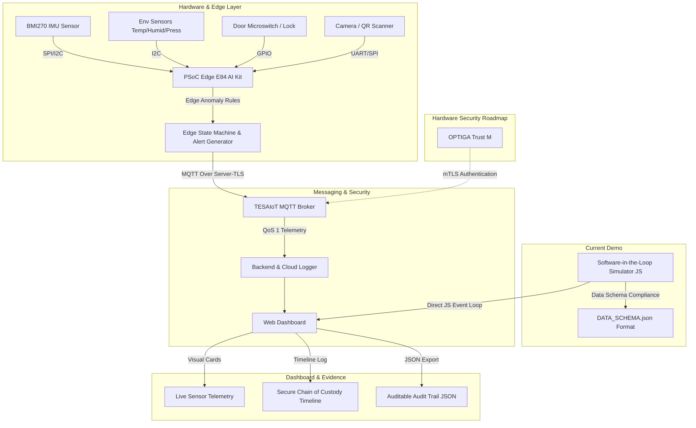

# LabMate Secure Rover Architecture & Integration Plan

## 1. System Overview (Software-in-the-Loop vs Final Hardware)

LabMate Secure Rover คือระบบขนส่งครุภัณฑ์และเอกสารสำคัญภายในวิทยาเขตแบบไร้คนขับ โดยมุ่งเน้นระบบ **Secure Chain of Custody** ที่สามารถตรวจสอบยืนยันตัวตนผู้ส่ง-ผู้รับ และสตรีมข้อมูลสภาพแวดล้อม (IMU, ความเอียง, อุณหภูมิ, ความชื้น, สวิตช์ฝากล่อง) เพื่อตรวจจับสิ่งผิดปกติระหว่างทาง

ในระยะเริ่มต้น **Current Phase** ใช้ระบบ **Software-in-the-Loop (SIL) Simulation** เพื่อยืนยัน Workflow, Data Schema, State Machine และ Dashboard โดยออกแบบให้ Data Schema ยืดหยุ่นและพร้อมสำหรับการเปลี่ยนสลับไปรับข้อมูลจากบอร์ด **Infineon PSoC Edge E84 AI Kit** ใน **Final-round Prototype**

---

## 2. System Architecture Diagram

---

## 3. Data Schema & MQTT Topic Hierarchy

### 3.1 Topic Structure
* **Telemetry Data:** `device/{DEVICE_ID}/telemetry`
* **Raw Sensor Data:** `device/{DEVICE_ID}/telemetry/sensor`
* **Event Notifications:** `device/{DEVICE_ID}/events`
* **Device Command Control:** `device/{DEVICE_ID}/commands/#` (e.g. `lock`, `unlock`, `reset_alert`)

### 3.2 Security Roadmap
1. **Current Demo (Phase 0):** Software-in-the-Loop Simulator บน Web Dashboard โดยใช้ Data Schema ตรงตามมาตรฐาน `DATA_SCHEMA.json`
2. **Phase 1 (Competition Demo):** เชื่อมต่อบอร์ด **PSoC Edge E84 AI Kit** ส่งข้อมูลผ่าน **MQTT Over Server-TLS** พร้อม QoS 1 เพื่อป้องกันข้อมูลสูญหาย
3. **Phase 2 (Production Grade):** เพิ่มชิปความปลอดภัย **OPTIGA™ Trust M** เพื่อยืนยันตัวตนระดับ Hardware ผ่าน **mTLS (Mutual TLS)** และบันทึก Log ลงในระบบนิเวศที่ไม่สามารถแก้ไขย้อนหลังได้ (Auditable Event Log)

---

## 4. Anomaly Threshold Assumptions (Prototype Calibration)
* **Impact Threshold:** `peak_g > 2.5g` -> `IMPACT_DETECTED` (CRITICAL)
* **Excessive Tilt Threshold:** `tilt_deg > 35.0°` -> `EXCESSIVE_TILT` (WARNING)
* **Unauthorized Door Access:** `door_state == "OPEN"` ขณะ `IN_TRANSIT` -> `UNAUTHORIZED_OPEN` (CRITICAL)
* **High Temperature:** `temperature_c > 30.0°C` -> `TEMPERATURE_HIGH` (WARNING)
* **High Humidity:** `humidity_rh > 70.0%` -> `HUMIDITY_HIGH` (WARNING)
